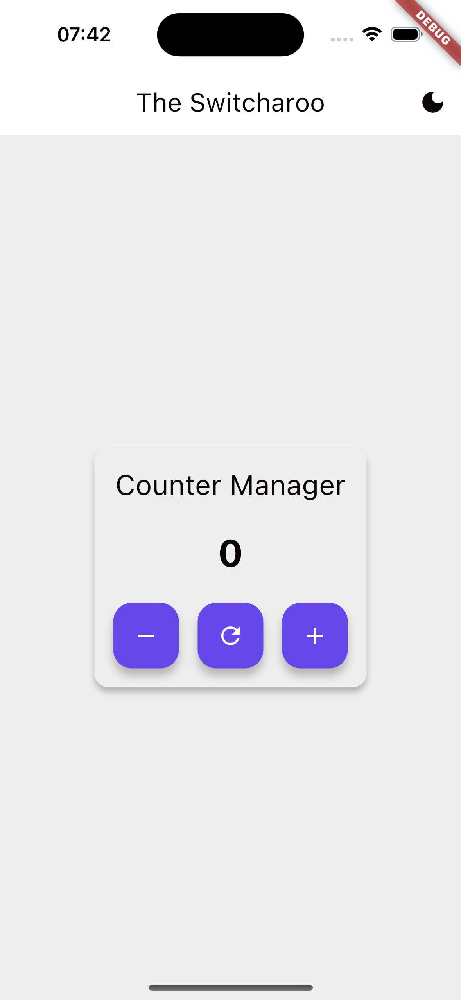
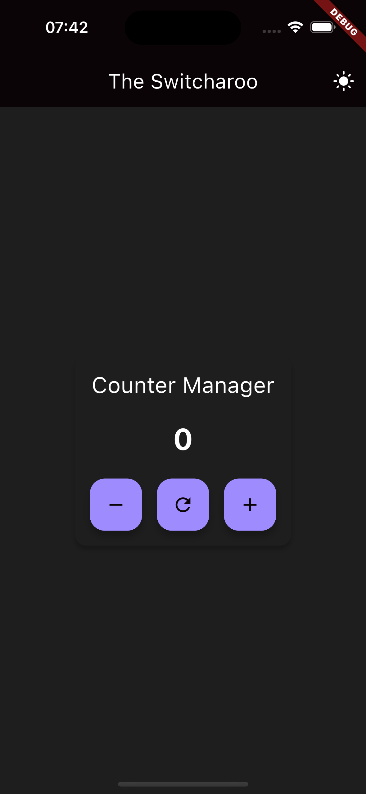

# Flutter Theme Switcher

A Flutter application demonstrating theme switching capabilities across the entire application using GetIt service locator and Material 3 design system.

## Features

- Light and dark theme support
- Material 3 design system implementation
- Consistent theme across the entire application
- Service locator pattern using GetIt
- Clean architecture with separation of concerns

## Project Structure

```
lib/
├── common_export.dart
├── get_it/
│   ├── export.dart
│   └── setup.dart
├── main.dart
├── screens/
│   ├── export.dart
│   └── home.dart
└── utils/
    └── theme/
        ├── app_colors.dart
        ├── app_theme.dart
        ├── export.dart
        └── theme_service.dart
```

### Key Components

- `get_it/`: Contains service locator setup and configuration
- `screens/`: Contains all application screens/pages
- `utils/theme/`: Contains theme-related utilities
    - `app_colors.dart`: Color constants and theme color mappings
    - `app_theme.dart`: Theme configuration using Material 3
    - `theme_service.dart`: Theme management service

### Project Packages

The project is organized into modular packages for better separation of concerns:

### app_database

A dedicated package for handling all database operations using ObjectBox:

- Provides type-safe database operations
- Implements DAO (Data Access Object) pattern
- Features:
  - Base DAO implementation for common operations
  - Database service singleton

### app_http

A robust HTTP client package built on top of Dio:

- Environment-specific configurations (development/production)
- Features:
  - Standardized API responses
  - Built-in error handling
  - Request/response logging
  - Retry mechanism
  - Progress tracking for uploads/downloads
  - Support for all standard HTTP methods
  - Header management
  - Type-safe API path construction

### app_prefs

A flexible shared preferences management package with support for both synchronous and asynchronous operations:

- Multiple preference management approaches:
  - Asynchronous preferences (AsyncPrefs)
  - Cached preferences with synchronous access (CachedPrefs)
  - Base abstractions for extensibility
- Features:
  - Specialized managers for different domains:
    - App preferences (general settings)
    - Authentication preferences
    - Theme preferences with caching
  - Type-safe preference access
  - Centralized preference key management
  - Easy initialization and cleanup
  - Built on top of shared_preferences package

## Getting Started

### Prerequisites

- Flutter SDK (>=3.5.4)
- Dart SDK (>=3.0.0)

### Installation

1. Clone the repository:
```bash
git clone https://github.com/yourusername/kib_theme_switcher.git
```

2. Navigate to project directory:
```bash
cd kib_theme_switcher
```

3. Install dependencies:
```bash
flutter pub get
```

4. Run the app:
```bash
flutter run
```

## Dependencies

- `flutter_bloc: ^8.1.6`: State management
- `get_it: ^8.0.3`: Service locator
- Other Flutter default dependencies

## Theme Configuration

The application uses Material 3 design system with custom color schemes for both light and dark themes. The theme configuration is handled by the `AppTheme` class which includes:

- Custom typography
- Color schemes
- Component themes (AppBar, Card, Button, etc.)
- Material 3 features

## Usage

To switch between themes, use the ThemeService through GetIt:

```dart
final themeService = GetIt.I<ThemeService>();
themeService.toggleTheme();
```

## Previews
### light

### dark


## Contributing

1. Fork the repository
2. Create your feature branch (`git checkout -b feature/AmazingFeature`)
3. Commit your changes (`git commit -m 'Add some AmazingFeature'`)
4. Push to the branch (`git push origin feature/AmazingFeature`)
5. Open a Pull Request

## License

This project is licensed under the MIT License - see the LICENSE file for details.

## Acknowledgments

- Flutter team for Material 3 support
- GetIt package for dependency injection
- Flutter Bloc for state management